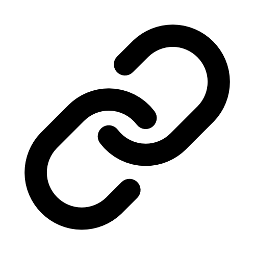
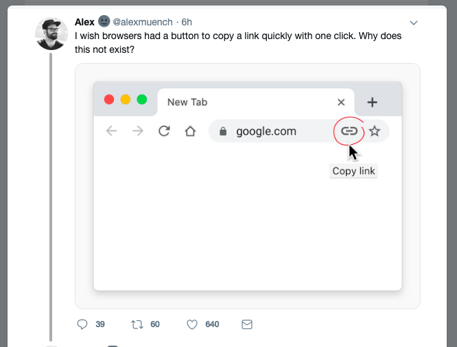

     
    
    

# Quick Copy URL Browser Extension
Quickly copy the URL of your current tab with a click.

Inspired by [a tweet by @alexmuench](https://twitter.com/alexmuench/status/1146792451165868033).

## Installation
"Quick Copy URL" is availible through the [Firefox Add-On Platform](https://addons.mozilla.org/en-US/firefox/addon/quick-copy-url/) and [chrome web store](https://chrome.google.com/webstore/detail/quick-copy-url/pejnfjhmapcmemanpjfalfkmeblolhnj).
You can also install this extension on Firefox by downloading the source from GitHub and loading the unpacked extension through "about:debugging" as a "Temporary Add-On".

## Contributing
Please fork this repository and create a new pull request to contribute to it.

If you notice any errors, please create a new issue on GitHub.
